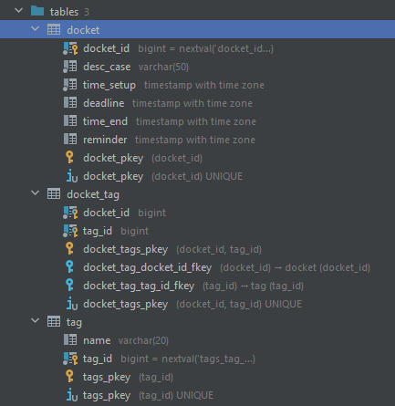

<h1 align="center">List To-Do</h1>

<h2 align="center">
      
</h2>

## Description

This is pet project where I reinforce my spring framework and Hibernate learning.

## About the project

### Database

The choice fell on postgreSQL because of the open source project. Created 3 (one of them is supported) tables:

<h2 align="center">
      
</h2>

### Hibernate

It helped to connect relationships Many to Many etc.

```  
@ManyToMany(
      cascade = {CascadeType.ALL},
      fetch = FetchType.EAGER)
@JoinTable(
      name = "docket_tag",
      joinColumns = {@JoinColumn(name = "docket_id")},
      inverseJoinColumns = {@JoinColumn(name = "tag_id")})
private Set<Tag> tags = new HashSet<>();
```

## Project setup

```
1. Download and install Tomcat 9(!!) version.

2. git clone https://github.com/gamesoze/ListTo-Do.git

3. Deploy the project on Tomcat.
```
